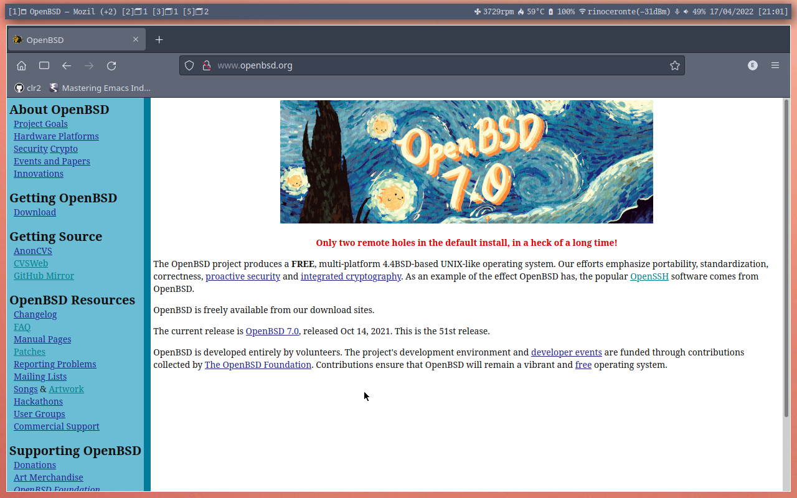

# termbar - A simple window manager status bar made with a xterm window

### Introduction
Termbar is a status bar made only with a xterm window and a shell script. This particular configuration is intended for use with OpenBSD and cwm, with only one external dependency (a font with the used glyphs), but could be adapted to work in other OS/WM.

The termbar idea came, originally, from [Vetelko][1], but this one is more directly based on the great [implementation by Joel Carnat][2] of the [Gonzalo's version][3]. This implementation adds, besides minor adaptations and corrections, a field (in leftmost position) showing:
   - the current group and active window's name
   - the number of other open windows in the current group
   - the number of open windows in each group

   

[1]: https://github.com/vetelko/termbar
[2]: https://www.tumfatig.net/2020/a-simple-shell-status-bar-for-openbsd-and-cwm1/
[3]: https://github.com/gonzalo-/termbar

### Screenshots



### Instructions:
- Put the `termbar`script in a directory where you keep your personal scripts (e.g `~/bin`) and make it executable. The script uses native OpenBSD commands to extract and format informations via functions. Then it loops into calling those functions, printing the whole result and pausing for 0.5s. The formatting should be adjusted to fit your screen size (the script here is tuned for a 1280x800 monitor) and the pause can be set to fit your preference.

- Put the code below in your `~/.Xresources` or `~/.Xdefaults`:
```
termbar*faceName: GoMono Nerd Font:style=Book:size=9:antialias=1
termbar*background: #4C566A
termbar*foreground: #D8DEE9
termbar*geometry: 179x1+8+6
termbar*internalBorder: 5
termbar*saveLines: 0
termbar*scrollBar: false
termbar*title: termbar
```
   For the glyphs, a font that provides them must be used. Any of the [nerdfonts](https://www.nerdfonts.com) should do well.
   The `geometry` should be adjusted to fit your screen size and position preference.

- Edit your `.cwmrc` reserving a gap and making cwm ignore termbar and show it in all groups:
```
gap 40 0 0 0
ignore termbar
autogroup 0 termbar
```

- Launch termbar automatically, putting the line below in `.xsession` or `.xinitrc` before the line that starts cwm. Substitute "youruser" with, well, your username:

`xterm -name termbar -class termbar -e /home/youruser/bin/termbar &`

To make the process of fitting the sizes to your screen size, there is a `termshim` script, that shows every field represented in its bigger possible lenght, an can be used instead of termbar, as a testbed for the adustments. Just start it with `xterm -name termbar -class termbar -e /home/youruser/bin/termshim` to see how your alterations will behave.


* The instructions in the implementations cited above should be quite useful too and I recommend you to look at them as well.

### Afterword
Your additions, scripts, functions, size configurations, etc, are very welcomed. Feel free to send them as issues, pull requests, email or twitter DM.
